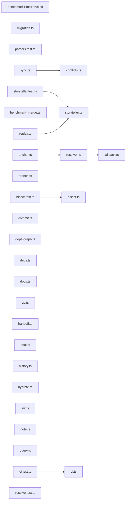

# Semantic Dependency Graph

This graph shows the relationships between files in your project, combining both code imports and AI semantic links (Memories & Decisions).

> Note: Nodes indicate the number of Memories (M) and Decisions (D) linked to each file.
