# ARCHITECTURE.md

> **Project**: aigit | **Branch**: main
> *Autogenerated by `aigit docs` carefully assembling Semantic Memory*

## Semantic Causal Graph

This diagram illustrates the causal relationships between Memories, Tasks, and Decisions, grouped by file location.

```mermaid
flowchart TD

  %% Nodes
  Task_7bcd26852f784433b06323a5dfbaf92f["📋 clean-architecture-generator"]:::task
  Mem_e0696389ada94846b8df61f2dab5936a("🧠 Automatic Git Commit Context (Staged Cha..."):::memory
  Mem_691f28c6a7ba4a7a96cfb6fe0dcb9dde("🧠 Automatic Git Commit Context (Staged Cha..."):::memory
  Mem_40cd5a6e34124ced836c62cf1a978e21("🧠 Automatic Git Commit Context (Staged Cha..."):::memory
  Mem_41aba1d62b9b494ba4c155500bfcf1b0("🧠 Automatic Git Commit Context (Staged Cha..."):::memory
  Mem_614dd17f86704bb696c70182f0b9f9fe("🧠 Automatic Git Commit Context (Staged Cha..."):::memory
  Mem_7007cce80ea64cb593eb9061712cf962("🧠 Automatic Git Commit Context (Staged Cha..."):::memory
  Mem_f3f4409edf1b44dfaada1ab916c39637("🧠 Automatic Git Commit Context (Staged Cha..."):::memory
  Mem_4d4ab24ee7d8429f93185fb61934b464("🧠 Automatic Git Commit Context (Staged Cha..."):::memory
  Mem_43b67e795f2941f1a30c7ca626c81da6("🧠 Automatic Git Commit Context (Staged Cha..."):::memory
  Mem_2a9396dc5aa74d3a9d87a6e8585628c7("🧠 Testing fixed ledger dump for Agent-Driv..."):::memory
  Mem_f3443c23c6f0498db4ffacd12bd9facc("🧠 Automatic Git Commit Context (Staged Cha..."):::memory
  Mem_1e5d8068b2734106834e0cbb825d7002("🧠 Automatic Git Commit Context (Staged Cha..."):::memory
  Mem_0d1a98189d354dd1bd31ee7238a875b3("🧠 Updated frontend/src/DocsPage.tsx to doc..."):::memory
  Mem_b2f63370cfb048daab44702f43481629("🧠 Added aigit.commitMemory command to vsco..."):::memory
  Mem_7b7c43c0ddc94e2fadb5c1a9e15b3f94("🧠 Dummy summary for strict validation test"):::memory
  Mem_27ca22f5987f4d91ac1336dceb170e71("🧠 Replaced interactive bypass prompt with ..."):::memory
  Mem_da45941d6e2c4de6858d860ca2c33733("🧠 Implemented strict non-bypassable git ho..."):::memory
  Mem_0f566571ee7349ea8dabf25a2609f0e0("🧠 Testing the smart hybrid fallback path."):::memory
  Mem_6c5435ad254d4fcf9ec3433714daa419("🧠 Replaced the strict commit hard-block wi..."):::memory
  Mem_b066c9540e3a41cdaaffd34bbb0b4949("🧠 Updated the DocsPage frontend to detail ..."):::memory
  Mem_74cefc04fbdd4c98a0c8072f9e7d0b35("🧠 Added explicit 'FATAL CONSEQUENCE' warni..."):::memory
  Mem_48f0016fe7af4bef85c0983380348359("🧠 Documented the new Smart Hybrid Git Hook..."):::memory
  Mem_9ec96b6b6f43478888aa924bb7dfa056("🧠 Added a root package.json router to allo..."):::memory
  Mem_57fa7b0cc97a4941a11876b85dc56755("🧠 Bumped aigit-core version to 1.1.3 to re..."):::memory
  Mem_78e50f73d306431bbd4a342a2f520707("🧠 Refined frontend UI to support a profess..."):::memory
  Mem_e082dcd449954848bc7566c121db8434("🧠 Added GitHub repository link to Navbar. ..."):::memory
  Mem_fd3e3e0ce4c24619a75c795110236c40("🧠 Optimized context-server/ARCHITECTURE.md..."):::memory

  %% Causal Links

  %% Subgraphs by File Path
  subgraph File0 ["📁 git-commit-staged"]
    Mem_e0696389ada94846b8df61f2dab5936a
    Mem_691f28c6a7ba4a7a96cfb6fe0dcb9dde
    Mem_40cd5a6e34124ced836c62cf1a978e21
    Mem_41aba1d62b9b494ba4c155500bfcf1b0
    Mem_614dd17f86704bb696c70182f0b9f9fe
    Mem_7007cce80ea64cb593eb9061712cf962
    Mem_f3f4409edf1b44dfaada1ab916c39637
    Mem_4d4ab24ee7d8429f93185fb61934b464
    Mem_43b67e795f2941f1a30c7ca626c81da6
    Mem_f3443c23c6f0498db4ffacd12bd9facc
    Mem_1e5d8068b2734106834e0cbb825d7002
  end

  %% Styling
  classDef task fill:#4f46e5,stroke:#fff,stroke-width:2px,color:#fff,rx:5,ry:5
  classDef memory fill:#059669,stroke:#fff,stroke-width:2px,color:#fff,rx:20,ry:20
  classDef decision fill:#d97706,stroke:#fff,stroke-width:2px,color:#fff
```

## Core Principles & Memories

- **[capability]**: Testing fixed ledger dump for Agent-Driven workflow (Attempt 2) *(Added: 2026-03-07)*
- **[architecture]**: Updated frontend/src/DocsPage.tsx to document the new Agent-Driven commit workflow. *(Added: 2026-03-07)*
- **[architecture]**: Added aigit.commitMemory command to vscode-aigit extension allowing developers to commit semantic memory via Command Palette. *(Added: 2026-03-07)*
- **[architecture]**: Dummy summary for strict validation test *(Added: 2026-03-07)*
- **[architecture]**: Replaced interactive bypass prompt with a strict process.exit(1) hard block in the pre-commit hook to physically prevent AI agents from skipping the semantic commit rule. *(Added: 2026-03-07)*
- **[architecture]**: Implemented strict non-bypassable git hooks. Replaced interactive TTY prompts with a hard process.exit(1) block to forcefully prevent AI agents from skipping semantic commit requirements. *(Added: 2026-03-07)*
- **[architecture]**: Testing the smart hybrid fallback path. *(Added: 2026-03-07)*
- **[architecture]**: Replaced the strict commit hard-block with a Smart Hybrid TTY check. Human devs are seamlessly prompted inline for a semantic summary to save their commit momentum, while headless AI agents are strictly blocked to enforce compliance. *(Added: 2026-03-07)*
- **[architecture]**: Updated the DocsPage frontend to detail the new Smart Hybrid Commit Enforcement approach for pre-commit hooks. *(Added: 2026-03-07)*
- **[architecture]**: Added explicit 'FATAL CONSEQUENCE' warnings directly into the AI agent prompt files (AGENTS.md, GEMINI.md). This ensures headless AI agents are aware of the strict isTTY git hook and do not waste tokens attempting raw git commits. *(Added: 2026-03-07)*
- **[architecture]**: Documented the new Smart Hybrid Git Hooks in both the main README and the context-server README to highlight the split AI/Human developer experience. *(Added: 2026-03-07)*
- **[architecture]**: Added a root package.json router to allow 'npm test' to correctly trigger child package tests, enabling the local CI 'aigit heal' workflow on pre-push. *(Added: 2026-03-07)*
- **[architecture]**: Bumped aigit-core version to 1.1.3 to release the new Smart Hybrid Git Hooks (pre-commit  logic) to the npm registry. *(Added: 2026-03-07)*
- **[architecture]**: Refined frontend UI to support a professional Light Mode. Abstracted hardcoded transparent dark grays into CSS variables and customized the contrast of terminal simulation blocks, documentation grids, and feature cards. *(Added: 2026-03-08)*
- **[architecture]**: Added GitHub repository link to Navbar. Resolved context drift across AI instruction files by standardizing synced rules. Ignored scripts directory in git. *(Added: 2026-03-10)*
- **[architecture]**: Optimized context-server/ARCHITECTURE.md generator to strip redundant git stats and truncate bloated Git Commit Contexts from file-based tracking structure directly. *(Added: 2026-03-11)*

## Implementation Details (By File)

### `git-commit-staged`

## Task History

### ✅ clean-architecture-generator (`clean-architecture-generator`)
- **Status**: DONE
- **Created**: 2026-03-11

